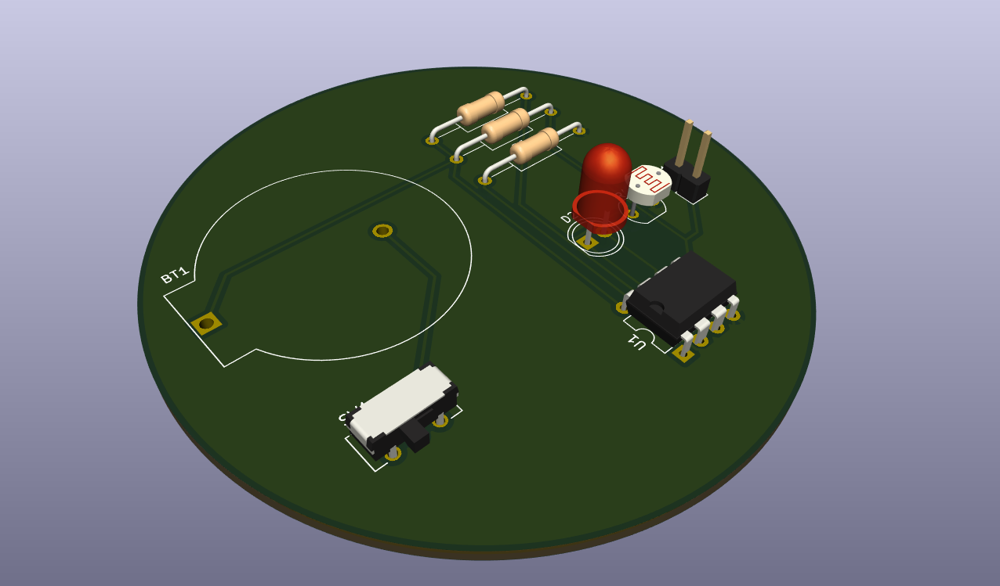
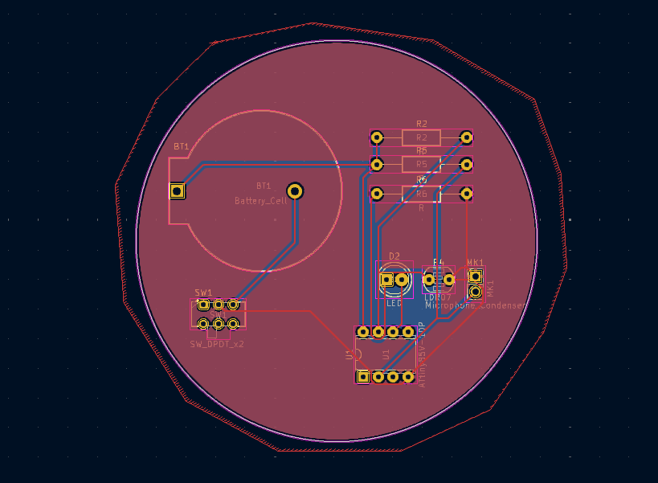
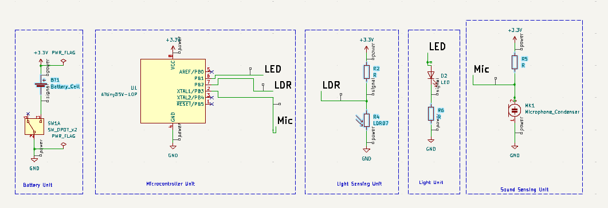
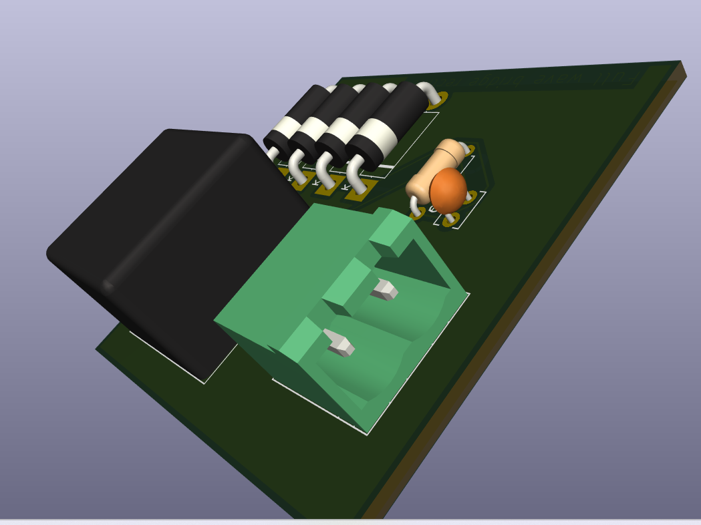
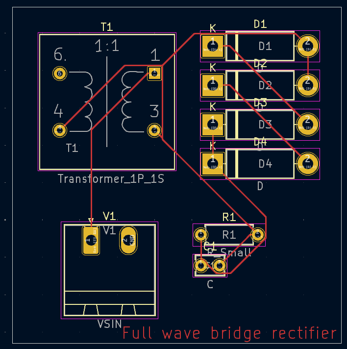

# PCBits

Welcome to **PCBits**, a repository where I share my PCB designs, schematics, and Gerber files. Whether you're looking for inspiration or a starting point for your own electronics projects, this repository has something for everyone!

---

## 📂 Repository Contents

1. **PCB Designs**
   - 3D renderings of the designed PCBs.
   - Layout previews of the PCBs with traces and pads.
   
2. **Schematic Diagrams**
   - Easy-to-follow circuit schematics for each design.

3. **Gerber Files**
   - Ready-to-fabricate files for your PCB projects.

---

## 🔧 Featured Design

### **1) Project: Digitalite -- Reactive to Light and Sound**

This project is built around the **ATTiny85 microcontroller** and includes the following features:
- **Light Sensing Unit**: Uses an LDR to detect changes in ambient light.
- **Sound Sensing Unit**: Equipped with a microphone for sound detection.
- **Battery Unit**: Powered by a compact coin cell.
- **LED Output**: Displays outputs based on sensor input.

### Key Images

1. **3D PCB View**  
   

2. **PCB Layout**  
   

3. **Schematic Diagram**  
   

### **2) Project: Full wave bridge rectifier -- Converts AC to DC output**

This project is built using a Transfomer having two coils,one secondary and one primary coil and includes the following features:
- Capacitor has been added to clear out the ripples and smoothen the pulsating DC waveform in the output.
- Resistor has been used as a load.

### Key Images

1. **3D PCB View**  
   

2. **PCB Layout**  
   

---

## 🛠️ Tools Used

- **KiCAD** for PCB design and schematic creation.
- **ATTiny85 Microcontroller** for circuit implementation.

---

## 🚀 How to Use

1. **View PCB Designs**:
   - Open the 3D PCB render images to see a visual representation.
   
2. **Modify the Design**:
   - Clone the repository and open the `.kicad_pcb` or `.sch` files in KiCAD.

3. **Fabricate the PCB**:
   - Use the Gerber files in the `/Gerber` directory to order PCBs from your preferred manufacturer.

---

## 📜 License

This project is licensed under the MIT License - feel free to use, modify, and distribute the files.

---

## 🤝 Contributing

Have ideas or improvements for the designs? Feel free to fork the repository and submit a pull request!

---

### 💬 Feedback

If you have any feedback or questions about the designs, please open an issue or reach out directly.

---

Happy PCB designing! 😊
